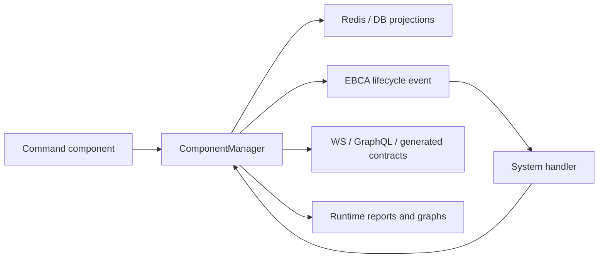

# EBCA TypeScript

Event-Based Component Architecture for TypeScript and NestJS.

EBCA is a small framework for building stateful products out of explicit entities, components, lifecycle events, and systems. It gives you an application model that is easy to run horizontally, easy to inspect at runtime, and easy for humans and AI agents to reason about without reading every service by hand.

It is designed for backends where state changes matter: games, simulations, trading loops, workflow engines, operational tools, collaborative products, and systems where commands should become durable, observable state transitions instead of disappearing into service methods.

## Why EBCA

Most backend systems start with services and DTOs. That works until the product grows: flows cross domains, read models diverge, side effects hide in handlers, and it becomes hard to answer simple questions:

- Who owns this state?
- What happens after this command?
- Which handler can write this component?
- What does the frontend actually receive?
- Can this command be replayed, inspected, delayed, or ordered?
- Can an AI agent safely change this workflow without guessing?

EBCA makes those answers explicit.

- State is modeled as typed components on typed entities.
- Every change goes through one write path: `ComponentManager`.
- Systems subscribe to component lifecycle events with `@EbcaPattern`.
- Runtime metadata describes entities, components, handlers, IO, queries, and transport contracts.
- Optional gateways expose the same declarative surface through WebSocket or GraphQL.
- The CLI can inspect the live registry, render graphs, report ownership risks, and generate contracts.

The result is a backend that behaves like a living graph of state transitions instead of a pile of hidden method calls.

## The Core Idea



An EBCA application is built from a few primitives.

| Primitive | Purpose |
| --- | --- |
| Entity | Aggregate or read-model target, such as `PlayerEntity`, `OrderEntity`, or `QuestEntity`. |
| Component | Typed state, fact, command, input, or result attached to an entity. |
| System | NestJS class that reacts to component lifecycle events. |
| Pattern | `@EbcaPattern(...)` subscription: entity + event type + component. |
| Manager | `ComponentManager` is the single write/read path for component state and lifecycle publication. |
| Query | `@EbcaReadRepository`, `@EbcaQuery`, and `@EbcaQueryParam` describe read-side methods without DTO sprawl. |
| Contract | `@EbcaType` and `@EbcaEnum` mark exported types for generated transport contracts. |

Commands are components too. A boundary writes an intent component, a domain system owns its handling, and the result is visible through component lifecycle rather than ad-hoc return values.

## Why It Matters In The AI Era

AI coding agents are powerful, but they are most useful when the codebase tells them the truth.

EBCA gives agents and humans a compact map of the system:

- Runtime metadata says which systems exist and what they listen to.
- `@EbcaIO` can declare what a handler may read, write, emit, or remove.
- CLI reports can show command flows, owners, fan-out, empty IO, boundary risks, and process depth.
- Generated contracts come from registered runtime metadata, not from hardcoded source folders.
- Transport adapters stay thin, so business logic remains in systems instead of leaking into WebSocket, GraphQL, REST, or bot code.

That makes the architecture more searchable, testable, and reviewable. An AI agent can ask the framework what the workflow is before editing it. A reviewer can inspect a command path without opening twenty files. A production operator can see state transitions as data.

## Packages

| Package | Role |
| --- | --- |
| `@ebca/core` | Runtime, decorators, `ComponentManager`, persistence, delayed streams, ordered ingress. |
| `@ebca/cli` | Runtime inspection, reports, graphs, admin component commands, contract generation. |
| `@ebca/ws-gateway` | Optional Socket.IO/NestJS gateway for component mutation, requests, projection, and queries. |
| `@ebca/gql-gateway` | Optional GraphQL gateway for queries, inbound components, snapshots, and subscriptions plus `@ebca/gql-gateway/nestjs`. |
| `@ebca/healthcheck` | Optional NestJS health endpoint for database, Redis, and NATS readiness. |
| `@ebca/rest-gateway` | Optional REST adapter with Swagger docs for inbound components and read queries. |
| `@ebca/analytics-sink` | Optional NestJS/TypeORM sink that persists EBCA lifecycle events into `ecs_events`. |

Transport packages are opt-in. `@ebca/core` does not force WebSocket, REST, or GraphQL dependencies into your application.

## Working Example

The repository includes a runnable NestJS example in [`examples/counter`](./examples/counter).

It brings up PostgreSQL, Redis, and a JetStream-enabled NATS cluster, starts a real EBCA app, writes an `IncrementCounterCommandComponent` through `@ebca/rest-gateway`, handles it in `CounterSystem` through `@EbcaPattern`, persists `CounterValueComponent`, and reads the result back through a REST-open `@EbcaQuery`.

Run it from the repository root:

```bash
bun install
bun run build:all
bun run example:counter:infra
cp examples/counter/.env.example examples/counter/.env
bun run example:counter:build
bun run example:counter:start
```

Then send a command:

```bash
curl -X POST http://localhost:3000/ebca/components/CounterEntity/11111111-1111-4111-8111-111111111111/IncrementCounterCommandComponent/add \
  -H 'content-type: application/json' \
  -d '{"component":{"amount":3}}'

curl 'http://localhost:3000/ebca/queries/counterState?entityId=11111111-1111-4111-8111-111111111111'
```

The important files are:

| File | What to read |
| --- | --- |
| [`counter.components.ts`](./examples/counter/src/counter.components.ts) | Command and persistent state components. |
| [`counter.system.ts`](./examples/counter/src/counter.system.ts) | Real `@EbcaPattern` command handler. |
| [`counter.read-repository.ts`](./examples/counter/src/counter.read-repository.ts) | REST-open `@EbcaQuery` read model. |
| [`counter.module.ts`](./examples/counter/src/counter.module.ts) | NestJS wiring for EBCA, TypeORM, Redis, and NATS. |

After that, inspect the runtime:

```bash
ebca report summary --runtime-module ./src/runtime.module.ts
ebca report process --component PlaceOrderCommandComponent --depth 4
ebca contract websocket --out ./src/contracts/ebca.generated.ts
```

## Architecture Guarantees

EBCA is intentionally opinionated.

- One write path for component lifecycle.
- Stateless services; state lives in storage and event streams.
- Domain systems own business decisions.
- Gateways are adapters, not business logic containers.
- Read repositories are projection/read-side APIs.
- Contracts are declared in runtime metadata.
- Ordered ingress is opt-in per command path, not a global lock.
- Horizontal scaling is a first-class constraint.

This keeps the model boring in the places that must be reliable and expressive in the places where product logic belongs.

## Development

Install dependencies:

```bash
bun install
```

Build the monorepo:

```bash
bun run build
```

Build every package, including the optional NestJS GraphQL subpath:

```bash
bun run build:all
```

Check package contents before publishing:

```bash
bun run pack:dry-run
```

`@ebca/core` is built first because dependent package tsconfigs resolve `@ebca/core/*` from `packages/core/dist` during local monorepo validation.

## Publishing

Packages are scoped as public npm packages under `@ebca/*`.

```bash
npm publish --access public --workspace @ebca/core
npm publish --access public --workspace @ebca/cli
npm publish --access public --workspace @ebca/ws-gateway
npm publish --access public --workspace @ebca/gql-gateway
npm publish --access public --workspace @ebca/healthcheck
npm publish --access public --workspace @ebca/rest-gateway
npm publish --access public --workspace @ebca/analytics-sink
```

Run `bun run build:all` and `bun run pack:dry-run` before publishing.

## Status

EBCA is early-stage framework code extracted from a real event-driven backend. The public package surface is being prepared for npm publication, so expect fast iteration around documentation, release automation, and examples.

## License

Apache-2.0.
