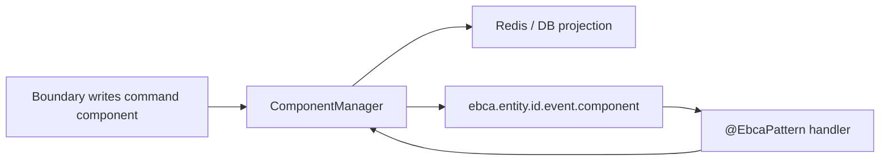

# @ebca/core

Core runtime for Event-Based Component Architecture.

`@ebca/core` gives a NestJS backend a typed component lifecycle: entities hold components, commands are components, systems react to lifecycle events, and all state changes go through `ComponentManager`.

It is the foundation package for EBCA. It does not include WebSocket, GraphQL, REST, or application-specific business logic.

## Install

```bash
npm install @ebca/core
```

Peer dependencies are intentionally explicit: NestJS, NATS, TypeORM, cache-manager, Redis/Keyv, RxJS, and reflect-metadata are supplied by the consuming application.

## What It Provides

- Base classes: `BaseEntity`, `BaseComponent`, `BaseCommandComponent`.
- Runtime decorators: `@Entity`, `@Component`, `@System`, `@EbcaPattern`.
- Read-side decorators: `@EbcaReadRepository`, `@EbcaQuery`, `@EbcaQueryParam`.
- Contract decorators: `@EbcaType`, `@EbcaEnum`.
- IO metadata: `@EbcaIO` for runtime architecture reports.
- Inbound component metadata for gateway operations, ownership, roles, and fields.
- Persistence mapping: `@PersistentProperty`.
- `ComponentManager` as the single component read/write path.
- TypeORM JSONB persistence and column projection support.
- NATS lifecycle publication.
- Delayed streams and opt-in ordered ingress for command paths.

## Mental Model



Commands, facts, inputs, and state are all represented as components. A gateway or API writes an intent component. A system owns the domain decision. The domain result is expressed as more component lifecycle, not as hidden side effects.

## Example

Use the runnable example in [`examples/counter`](../../examples/counter) as the canonical minimal app.

It shows the real core surface:

- `CounterEntity` extends `BaseEntity` and is registered with `@Entity`.
- `IncrementCounterCommandComponent` extends `BaseCommandComponent`.
- `CounterValueComponent` is a persistent `BaseComponent`.
- `CounterSystem` subscribes with object-form `@EbcaPattern`.
- `@ebca/rest-gateway` exposes REST mutations, Swagger, and read queries over the same `ComponentManager` path.

The example includes the required NestJS wiring for PostgreSQL, Redis, NATS, and `EbcaModule`.

Command components track their source (`system`, `websocket`, `rest`, or `graphql`) so gateways can share the same command base without hiding where an intent entered the system.

## Runtime Metadata

EBCA decorators register metadata at runtime. That metadata powers:

- handler discovery;
- architecture reports;
- command workflow graphs;
- IO coverage checks;
- generated transport contracts;
- optional WebSocket and GraphQL adapters.

This is the heart of why EBCA works well with AI-assisted development: the system can explain its own shape before a human or agent edits it.

## Ordered Ingress

EBCA can keep default NATS lifecycle behavior for most commands while enabling ordered ingress only where sequence matters.

When a handler pattern opts in, command publication resolves a shard at publish time, writes a JetStream envelope, replays the original EBCA topic through the partition consumer, and acknowledges only after the handler completes.

This avoids global locks and keeps horizontal scaling available.

## Boundaries

`@ebca/core` should stay domain-agnostic.

- Put business rules in systems.
- Put transport policy in adapters.
- Put read-side filtering in repositories.
- Use `ComponentManager` for state changes.
- Keep direct DB writes out of domain lifecycle code unless they are explicit read-model/projection concerns.

## License

Apache-2.0.
